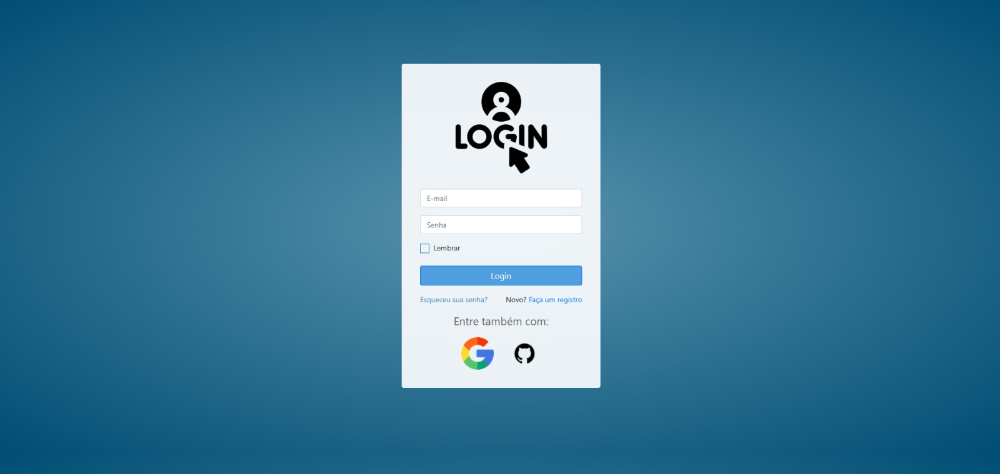
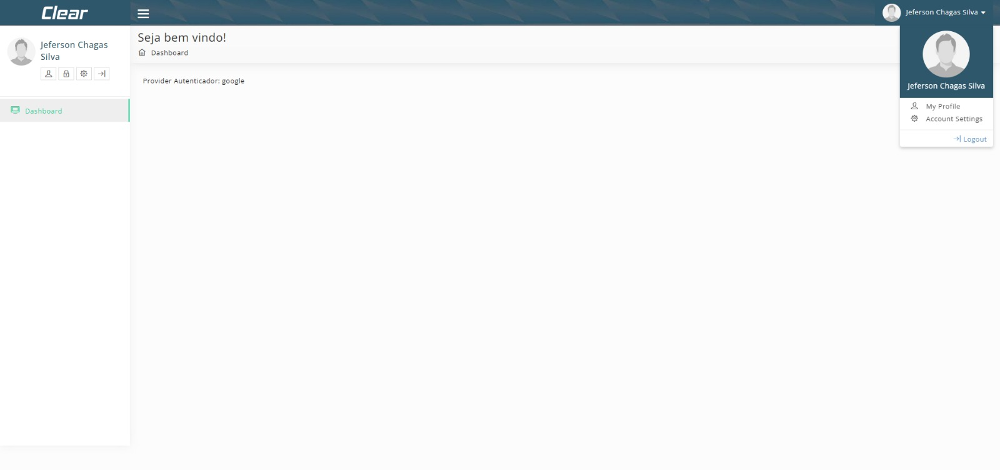

# PROJETO LARAVEL SOCIALITE

## 📖 Sobre o projeto

-   Criando um projeto o recurso do laravel chamado Laravel Socialite, que permite a autenticação no seu sistema web com determinados provedores OAuth como facebook, X, google, linkedin, github e etc.
-   No caso do projeto, foram implementadas autenticações com o google e o github, além da autenticação padrão.

## 🔨 Tecnologias utilizadas

-   [PHP](https://www.php.net/)
-   [Laravel](https://laravel.com/)
-   [Composer](https://getcomposer.org/)
-   [Mysql](https://www.mysql.com/)
-   [Laravel Herd](https://herd.laravel.com/)
-   [Apache](https://www.apache.org/)

## 🛎️ License

## 🤓 Autor

### Jeferson Chagas Silva

### https://jefersoniw.github.io/portfolio/

### https://www.linkedin.com/in/jefersoniw/
